# AWS 3-Tier VPC Architecture Project

## Project Overview

Designed and deployed a secure, highly available 3-Tier Virtual Private Cloud (VPC) 
architecture on AWS from scratch using the AWS Management Console. This project 
demonstrates core AWS networking, security, and compute skills including VPC design, 
subnet segmentation, Internet Gateway, NAT Gateway, Security Groups, Route Tables, 
and EC2 Bastion Host connectivity.

---

## Architecture Diagram

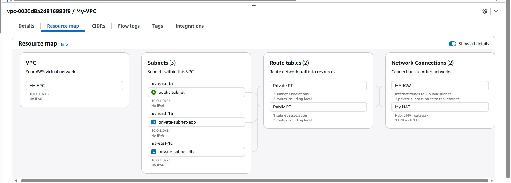

---

## AWS Services Used

- **Amazon VPC** — Custom virtual network with CIDR `10.0.0.0/16`
- **Subnets** — Public and Private subnets across 3 Availability Zones
- **Internet Gateway (IGW)** — Enables internet access for public subnet
- **NAT Gateway** — Allows private subnets to reach internet (outbound only)
- **Elastic IP** — Static public IP attached to NAT Gateway
- **Route Tables** — Public RT (via IGW) and Private RT (via NAT Gateway)
- **Security Groups** — Web-SG, App-SG, DB-SG with least-privilege rules
- **Amazon EC2** — Web Server (public) and App Server (private), Amazon Linux 2023
- **Bastion Host** — Secure SSH jump from public EC2 to private EC2

---

## Architecture Design

Internet
|
Internet Gateway (MY-IGW)
|
Public Subnet — 10.0.1.0/24 (us-east-1a)
| Web Server EC2 (Web-SG)
| NAT Gateway (Elastic IP)
|
Private Subnet App — 10.0.2.0/24 (us-east-1b)
| App Server EC2 (App-SG)
|
Private Subnet DB — 10.0.3.0/24 (us-east-1c)
DB Tier (DB-SG)

---

## Security Group Rules

### Web-SG (Public/Web Tier)
| Type  | Protocol | Port | Source    |
|-------|----------|------|-----------|
| HTTP  | TCP      | 80   | 0.0.0.0/0 |
| HTTPS | TCP      | 443  | 0.0.0.0/0 |
| SSH   | TCP      | 22   | My IP     |

### App-SG (Private/App Tier)
| Type       | Protocol | Port | Source |
|------------|----------|------|--------|
| SSH        | TCP      | 22   | Web-SG |
| Custom TCP | TCP      | 8080 | Web-SG |

### DB-SG (Private/Database Tier)
| Type         | Protocol | Port | Source |
|--------------|----------|------|--------|
| MySQL/Aurora | TCP      | 3306 | App-SG |

---

## What I Built — Step by Step

1. Created custom VPC (`My-VPC`) with CIDR `10.0.0.0/16`
2. Created 3 subnets across 3 Availability Zones (us-east-1a, 1b, 1c)
3. Created and attached Internet Gateway (`MY-IGW`) to VPC
4. Allocated Elastic IP and created NAT Gateway in public subnet
5. Configured Public Route Table → `0.0.0.0/0` via IGW
6. Configured Private Route Table → `0.0.0.0/0` via NAT Gateway
7. Created 3 Security Groups with least-privilege rules
8. Launched EC2 instances in public and private subnets
9. Connected to public EC2 via PuTTY — verified internet access
10. Used Bastion Host to SSH from public EC2 → private EC2
11. Verified private EC2 internet access via NAT Gateway (ping google.com ✅)

---

## Key Concepts Demonstrated

- **Network Segmentation** — Traffic isolated between Web, App, and DB tiers
- **Defence in Depth** — Multiple security layers (SG + NACLs + private subnets)
- **High Availability** — Subnets spread across 3 Availability Zones
- **Least Privilege Access** — App-SG only accepts traffic from Web-SG; DB-SG only from App-SG
- **Bastion Host / Jump Server** — Secure access pattern for private instances
- **NAT Gateway** — Outbound internet for private instances without exposing them

---

## Screenshots

| Step | Screenshot |
|------|-----------|
| VPC Created | 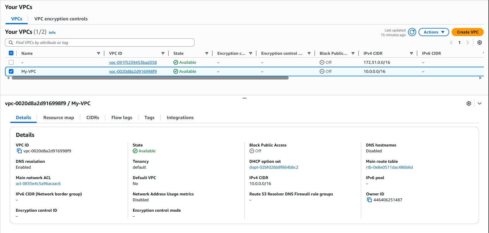 |
| Subnets | 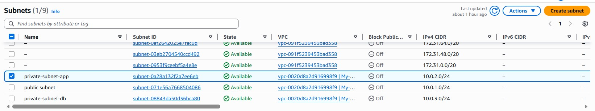 |
| Internet Gateway | 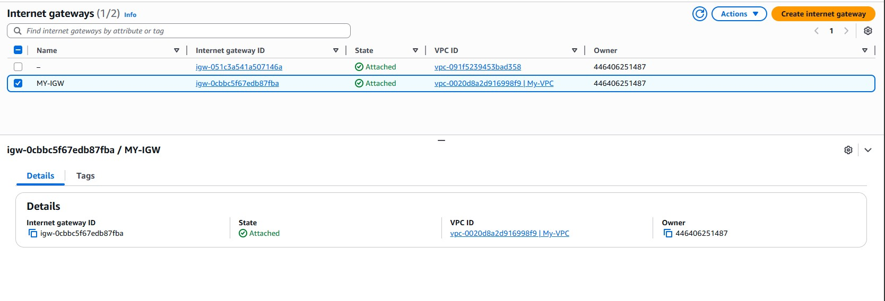 |
| NAT Gateway | 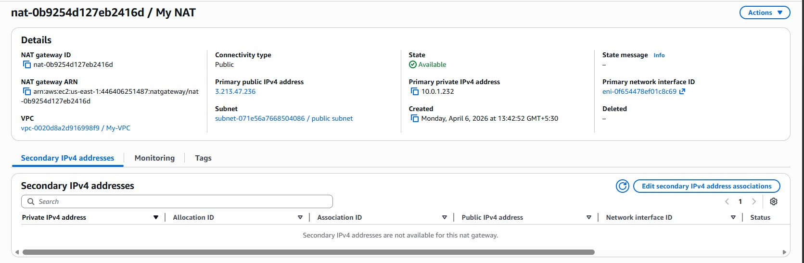 |
| Route Tables | 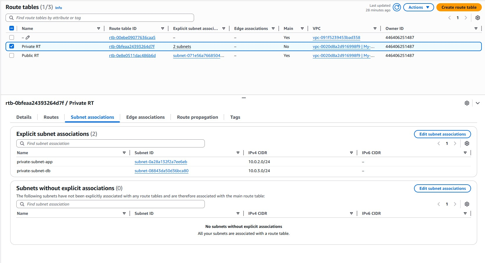 |
| Web-SG Rules | 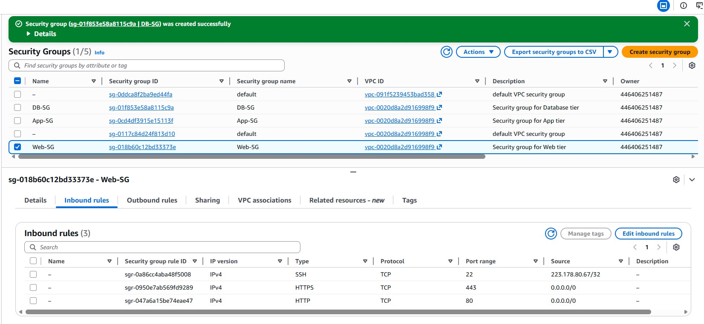 |
| App-SG Rules | 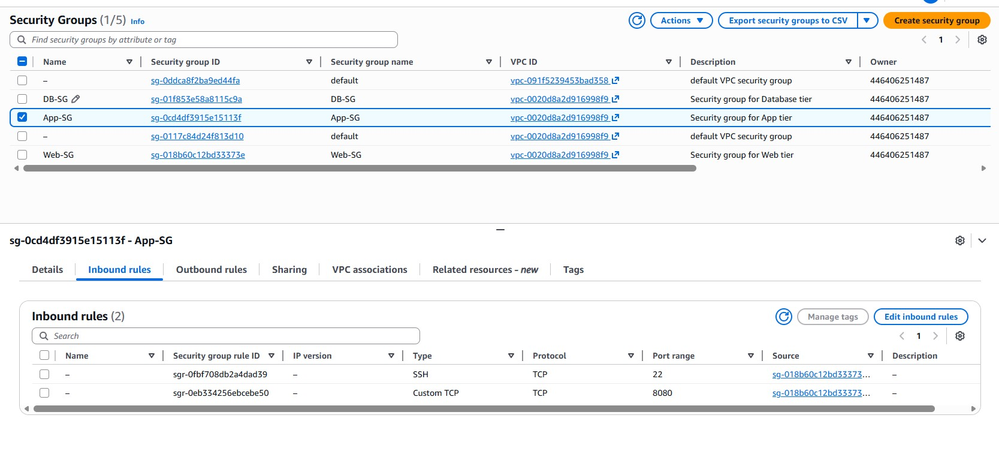 |
| DB-SG Rules | 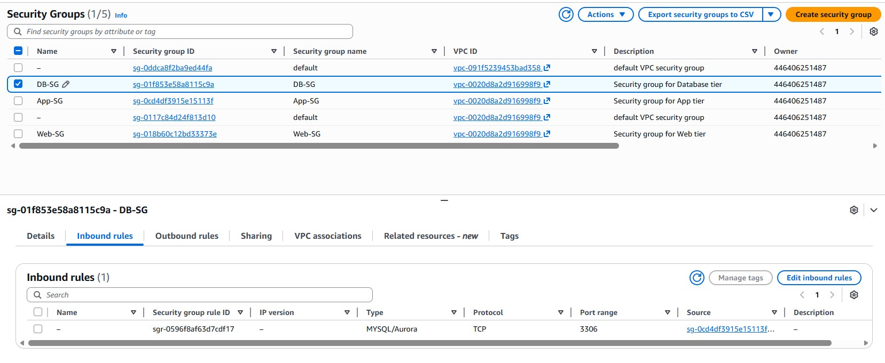 |
| Web Server EC2 | 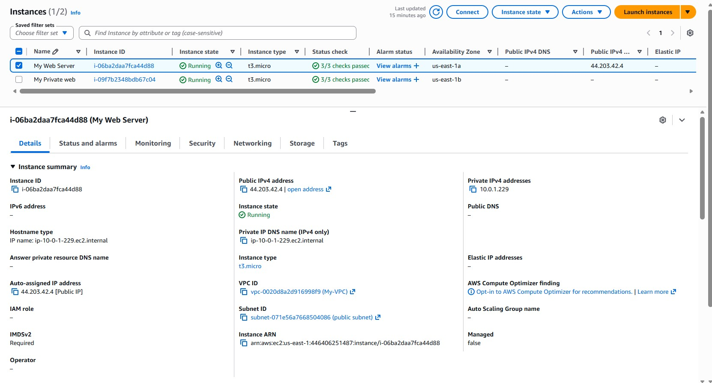 |
| Private EC2 | 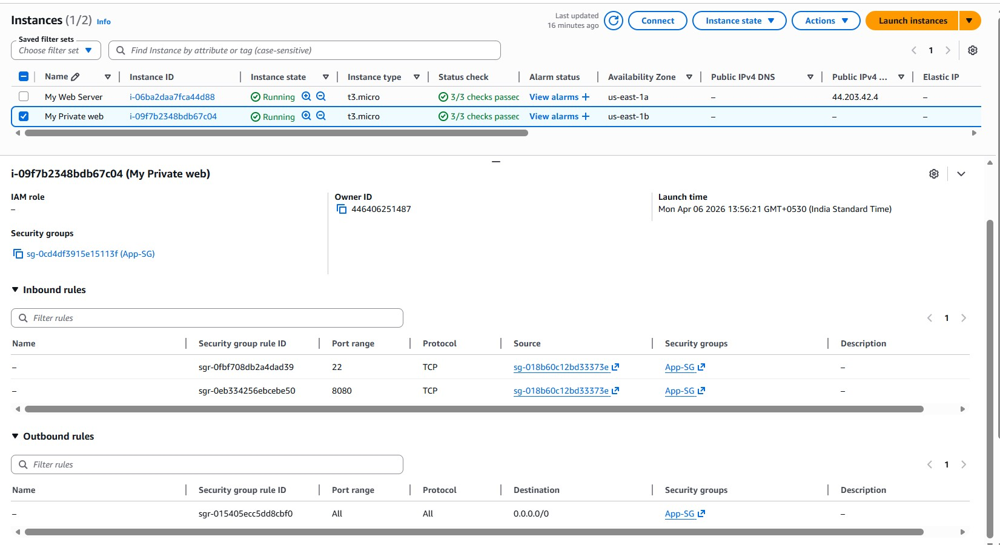 |
| Internet Test | 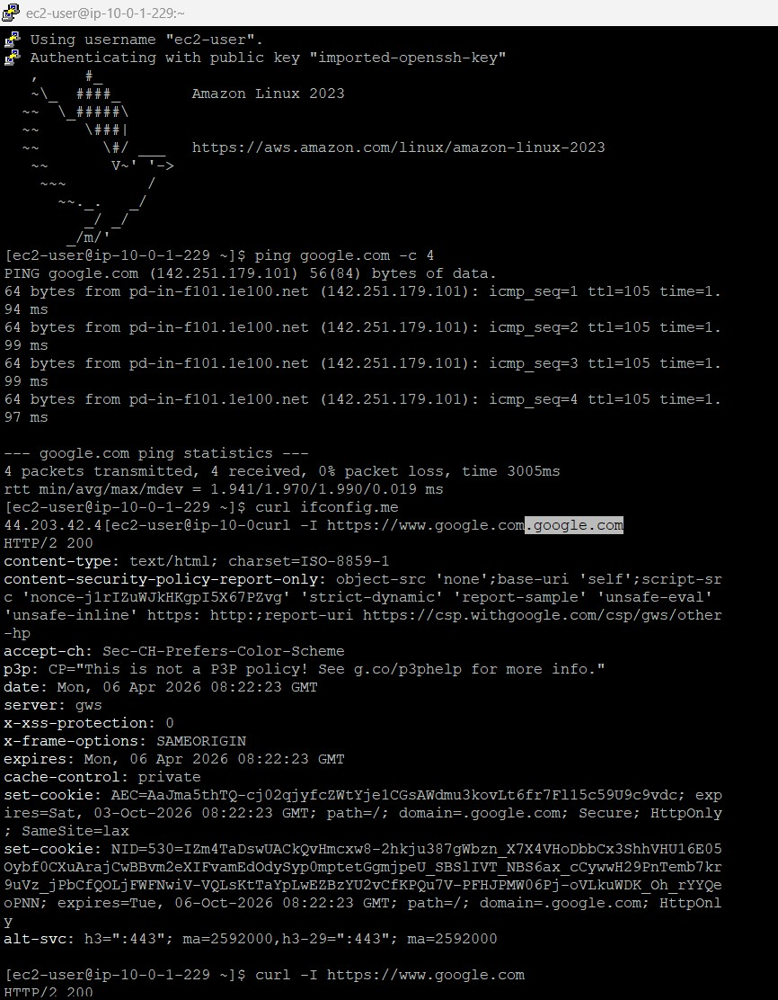 |
| Bastion Host Jump | 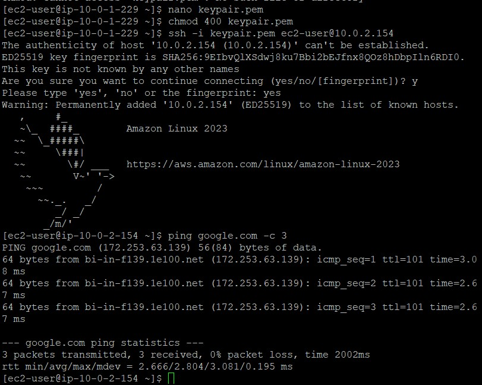 |
| VPC Resource Map |  |

---

## Author

**Gopinath Raju**
AWS Cloud Engineer | SAA-C03 
Chennai, Tamil Nadu, India
